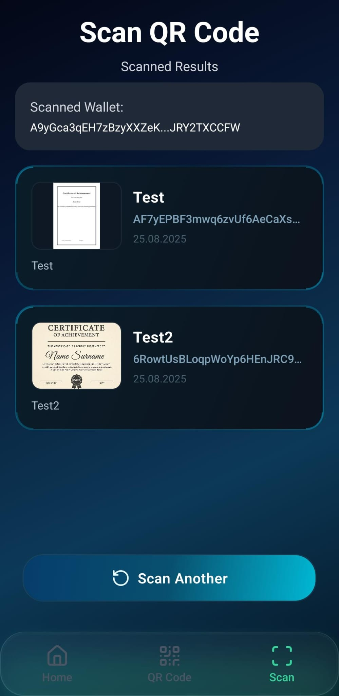
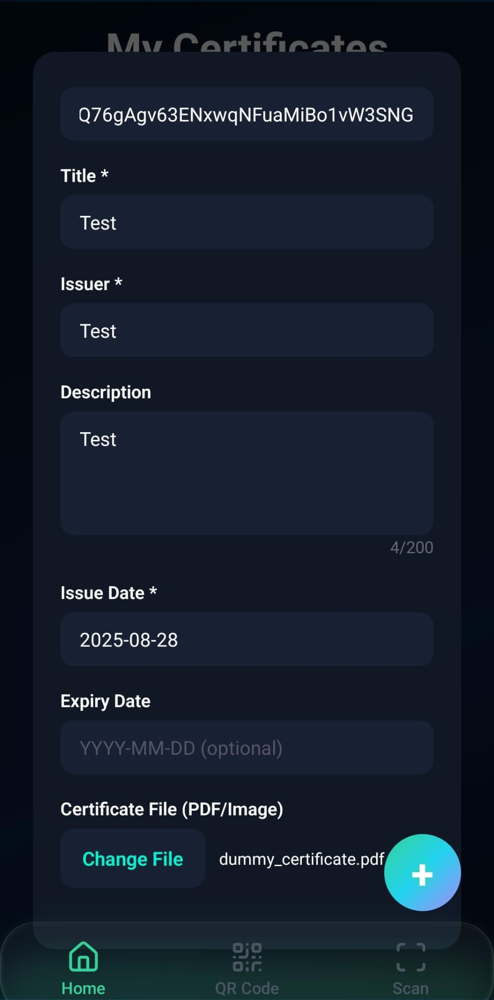

## CertifyOnChain

Issue and verify on-chain certificates on Solana devnet with a clean Expo/React Native UI and Supabase-backed storage.

### Features
- Mint certificate NFTs (symbol CERT) to recipient wallets
- Upload PDFs/images and JSON metadata to Supabase Storage
- Scan wallets via QR to view their CERT NFTs
- Animated, modern UI 
- Wallet: generates an ephemeral issuer keypair for demo — can be swapped to Phantom wallet integration

### Screenshots
- Scan QR Code Page  
	
- Add Certificate Form  
	
- QR Code / Address Page  
	

### Quick Start
```bash
npm install

# Create .env with your Supabase values
echo "EXPO_PUBLIC_SUPABASE_URL=YOUR_SUPABASE_URL" >> .env
echo "EXPO_PUBLIC_SUPABASE_ANON_KEY=YOUR_SUPABASE_ANON_KEY" >> .env

npx expo start
```
Open the app via Expo Dev Tools (device, emulator, or web).

### Environment
Add these to `.env`:
- `EXPO_PUBLIC_SUPABASE_URL`
- `EXPO_PUBLIC_SUPABASE_ANON_KEY`

Create two Supabase Storage buckets (public is fine for demo):
- `cert-files` — uploaded PDFs/images
- `cert-meta` — JSON metadata (URI saved on-chain)

### Usage
- Welcome: initialize an issuer wallet (ephemeral for this session)
- Home: enable chain and Add Certificate to mint on devnet; or keep chain disabled to add locally for demo
- QR Code: show your wallet QR and copy the address
- Scan: scan another wallet’s QR and fetch its CERT NFTs

### Phantom Wallet (ready to integrate)
The app currently generates an issuer keypair in-memory for simplicity. You can replace this with Phantom:
- Web: use the Solana Wallet Adapter and `window.phantom.solana` provider, then set the Metaplex identity to the adapter signer.
- Native: integrate a Phantom-compatible wallet adapter (deep links on mobile), and use its `publicKey`/signer in minting.

### Notes
- Requires devnet SOL to mint (auto airdrop attempted; use https://faucet.solana.com if rate-limited).
- Uses Tailwind via NativeWind and Node polyfills via Metro config.

### Disclaimer
CertifyOnChain is provided "as-is" without warranties. The developers are not liable for any security breaches, data loss, or issues arising from the use of this application. Users are advised to exercise caution and adopt additional security measures.

Developed by Tihoc Andrei
